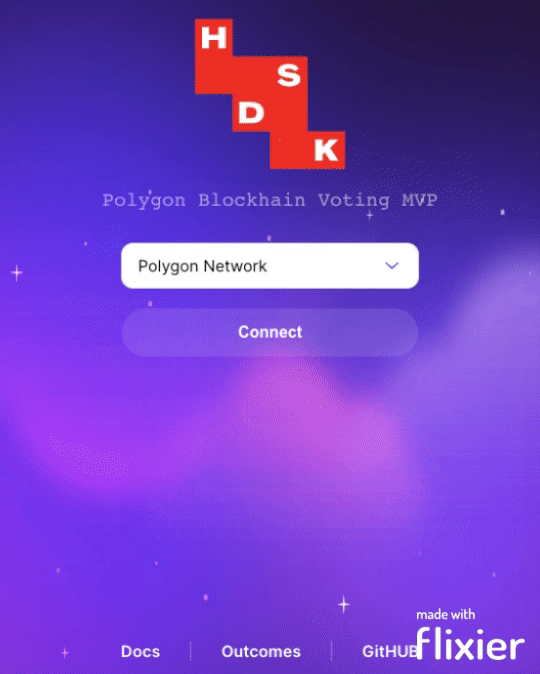

# Web3-Based Voting Application

This is a web3-based voting application that operates using smart contracts created on the Polygon blockchain. The application is built with TypeScript, React, Javascript, HTML, CSS, and Solidity. The idea behind this application is to allow users to register and receive their votes, while preserving anonymity and ensuring security.

## Fist look at the application

- Webapp starts with a login screen
- User is prompted to create account or login 
- Login is handled with MagicLink sent to email
- Non-custodial voting wallet is provision for all new accounts
- Login action will trigger a 6 digit access code emailed to user
- Correct code entry will allow the user to access their voting wallet

## Voting on the blockchain
Transparent election voting processes are critical to ensuring fair and trustworthy election outcomes. With the rise of blockchain technology, we now have an exciting opportunity to revolutionize the way we conduct elections, by providing a transparent and secure platform for casting and counting votes.

Unlike traditional methods of voting, blockchain technology creates a permanent and immutable record of each vote cast. This record is stored on a decentralized ledger, which means that it cannot be tampered with or altered in any way. This provides an unprecedented level of transparency and accountability, making it possible for independent auditors to verify the integrity of the voting process.

Additionally, blockchain technology enables the use of advanced data analysis techniques to provide deeper insights into election outcomes. This allows researchers to better understand voting patterns, demographics, and other critical data points that can inform future policy decisions.

In contrast, older methods of voting are prone to errors at multiple points in the process. Ballots can be lost or counted incorrectly, and manual counting processes can be slow, expensive, and error-prone. Furthermore, traditional methods of voting rely heavily on paper ballots, which not only contribute to carbon emissions but also require significant resources to print and distribute.

In conclusion, transparent election voting processes, such as blockchain voting, offer a more secure, efficient, and environmentally friendly way of conducting elections. By embracing these innovative new technologies, we can ensure that our democratic processes remain fair, transparent, and accessible to all.

## Utility 
Users register and receive their votes via SmartContract on Polygon blockchain. Users will be able to use passwordless Web3 & Web2 onboarding and authentication using email only authentication (magic link with magic.js). The app will allows users to gain access to a secure, non-custodial voting 'wallet' where they will be able to anonymously cast their votes. Election results are traceable on the blockchain to allow for complete transparency of the election process. Blockchain will allow for traceability of total number of casted votes, total number of people voted - however a complete anonymity will be preserved when voting whilst strict access control will ensure that only users with access to their email addresses will gain access to the non-custodial voting wallets.  

## Features
- Web3 and Web2 passwordless onboarding and authentication using email only authentication (magic link approach)
- Secure, non-custodial voting "wallet" where users can anonymously cast their votes
- Election results are traceable on the blockchain to ensure transparency of the election process
- Traceability of the total number of casted votes and total number of people who voted
- Strict access control to ensure that only users with access to their email addresses can gain access to the non-custodial voting wallets

## Technologies Used
- TypeScript
- React
- Javascript
- HTML
- CSS
- Solidity
- Polygon Blockchain

## Getting Started
To run the application, you will need to install the necessary dependencies by running:
`npm install`
Then, start the application by running:
`npm start`

## Contributing
Contributions to this project are welcome from the Election Project members.
Currently we are not accepting contributions from non-project members

If you would like to contribute, please fork the repository and create a pull request.
